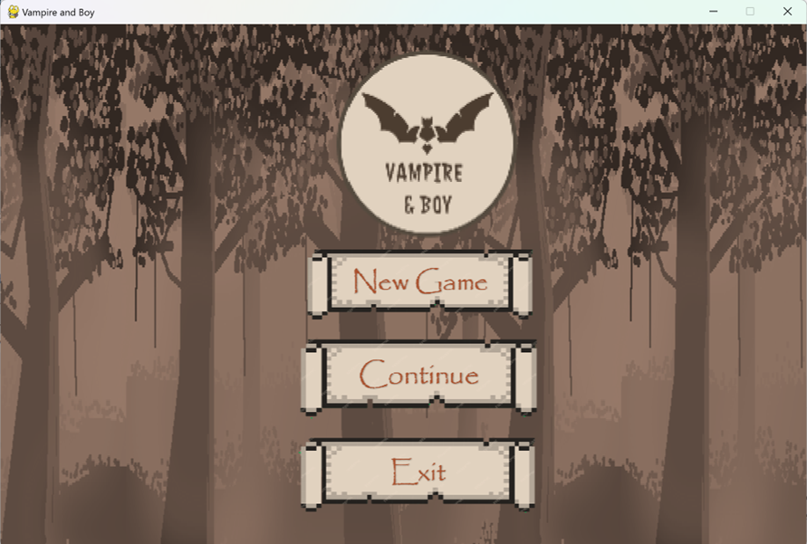
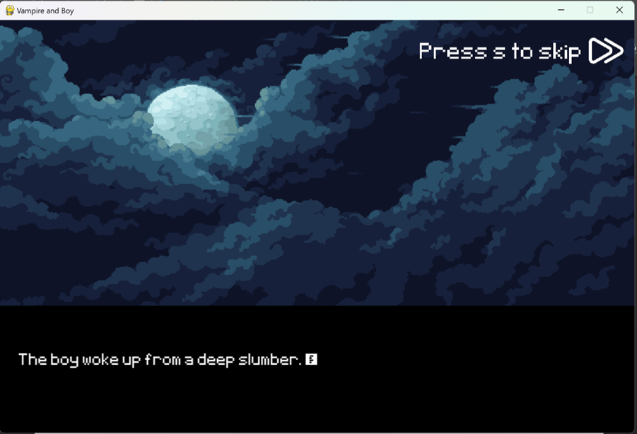
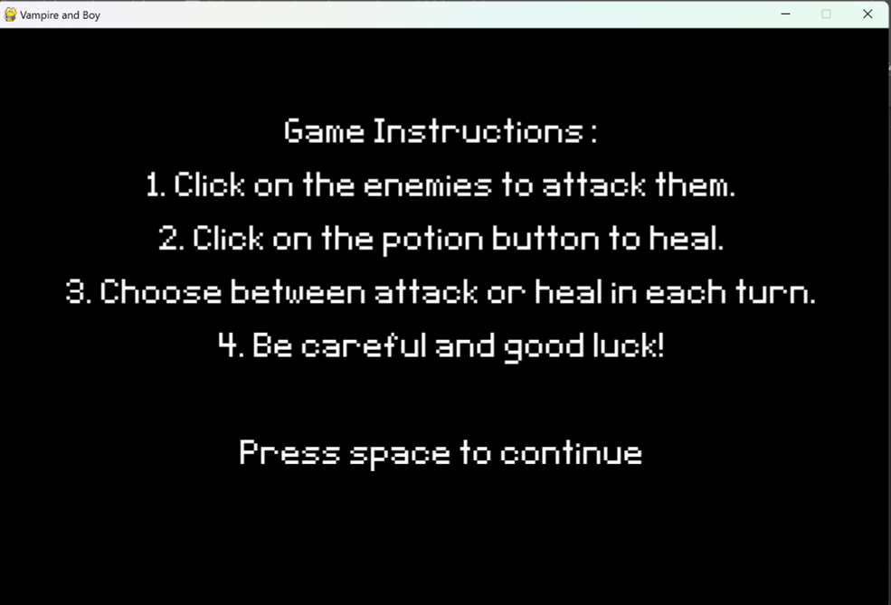
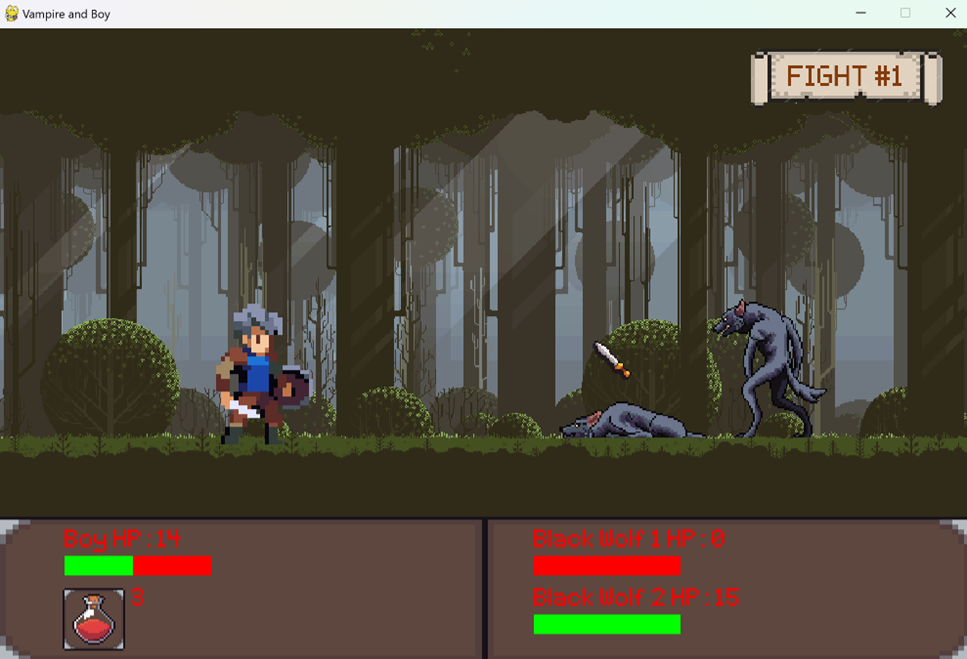
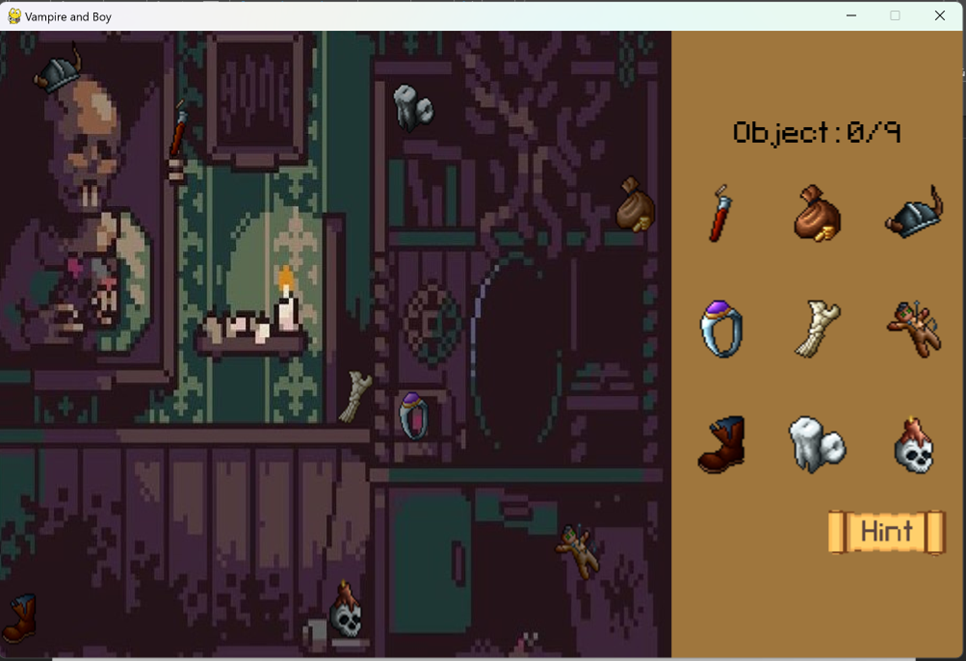

# Algorithm and Programming Final Project - Vampire and Boy

**Name:** Ellis Raputri

**Class:** L1AC

**ID Number:** 2702298116

<br>

## Project Description
Vampire and Boy, a story-based game that consists of fighting games and a finding object game. This game consists of several states, specifically one main menu, six cutscenes, three game instructions, five battles, and one finding object game.

<br>

## Demo Video
To access the demo video, click [here](https://drive.google.com/file/d/1GCMizYZuQlP3UqC7kEgyNNwDwT0oXUro/view?usp=sharing)

<br>

## Libraries Used
- Pygame - a module of Python that is designed to write games.
- Random - built-in Python library that deals with random numbers
- Sys - library that provides functions and variables related to the Python runtime environment.
- Math - library that provides various functions to do mathematical operations.

<br>

## Files
- button.py – to enable buttons
- continue_game.py - to enable the continue button
- damage_and_healthbar.py –  to display the damage and health bar. 
- fighter.py – to specify each individual’s animation and stats
- finding_object_thing.py – to display the objects in background, objects in list, and hint circles.
- game_function1.py – contains the algorithm and functions for the battle and finding object game.
- game_function2.py – run the game functions based on each state 
- img_text_display.py – to display images and text.
- main.py – the main file 
- running_text.py – shows and controls the dialogue on each cutscene.
- transition.py – to play the transition 
- ‘report’ folder – contains the project report and diagrams
- ‘Assets’ folder - contains the audio, font, images, and story in the game. 

<br>

## How to Install 
- Install Python and Visual Studio Code on your computer. 
- Open Visual Studio Code terminal and install Pygame by typing this code below.
    ```
    pip install pygame
    ```
- Download and extract the zip file of this repository.
- Open the main.py file in Visual Studio Code.
- Run the main.py file.
- Enjoy the game!

<br>

## Game Screenshots

Main Menu


Cutscene


Game Instruction


Battle


Finding Object



 
